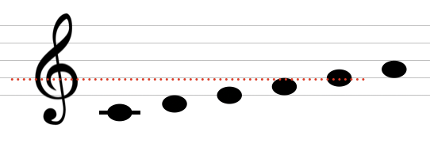
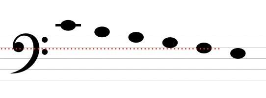
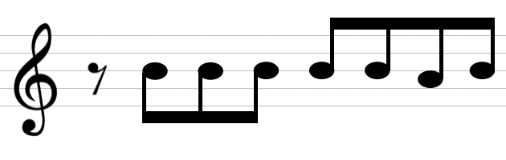

# 第一回音楽会

## 音名

音名とは、「ドレミファソラシド」などと言った音の言い表し方のことを言う  
各国で音名は異なる

| Country | Name   |        |      |      |      |      |      |
|---------|--------|--------|------|------|------|------|------|
| Italy   | ド     | レ     | ミ   | ファ | ソ   | ラ   | シ   |
|         | Do     | Re     | Mi   | Fa   | Sol  | La   | Si   |
| Germany | ツェー | デー   | エー | エフ | ゲー | アー | ハー |
|         | C      | D      | E    | F    | G    | A    | H    |
| America | スィー | ディー | イー | エフ | ジー | エイ | ビー |
|         | C      | D      | E    | F    | G    | A    | B    |
| Japan   | ハ     | ニ     | ホ   | ヘ   | ト   | イ   | ロ   |

ギター等などのコード譜に使われる音名はアメリカ式  
クラシックなどでは主にドイツ式の音名を用いる  

## 階名

上記の表では、「ド」はドイツ式で「C」ではないか？となるが、実際は音名以外に階名と呼ばれるものがある  
音名では絶対的な音の高さを表すのに対し、階名では相対的な音の高さを表す  

### 例: ピアノの「ド」とクラリネットの「ド」は同じ音ではない

ピアノの「ド」は上記の音名通りCを指すがクラリネットはB♭管の楽器で、  
これはつまりB♭ないしピアノで言うところの「シ♭」の音を「ド」として考える楽器のことを指す

日本で階名には、主にイタリアの音名表記が用いられている

## ト音記号とヘ音記号

五線譜（５本の線でできている楽譜）は、古くから一般的ではなかった  
国や時代における様々な書き方がある中で、きちんとした音の高さを表現するために共通記号が作られた  

ト音記号は、日本の音名のトである「ソ」の音を指し示す  

ヘ音記号は、日本の音名のへである「ファ」の音を指し示す  

またハ音記号についても同じ要領で認識できる  

## 変化記号

変化記号とは、音を半音単位で高くしたり低くしたりするための記号のことを言う

| 記号 | 読み方   | 内容           |
|------|----------|----------------|
| ♯    | シャープ | 音を半音あげる |
| ♭    | フラット | 音を半音下げる |

※ ダブルフラットやダブルシャープ、ナチュラルも存在するが割愛する

## 小節

楽譜は、小節と言う枠で分割される  
何も指定されていない場合、1小節は4拍分の音を配置することができる  

## 休符

楽譜上、音を出さない時に使う記号のことを指す

### 例: 井上陽水「夢の中へ」

「探し物は何ですか」の歌詞の前に、8分休符が存在する  

休符に関する詳細は次回に記載  
余談だが、1拍分を分けたうちの前半部分を表拍、後半部分のことを裏拍と言う

## その他

### ミとファ、シとドの間にはなぜ黒鍵がないのか

音は1オクターブ12音から成り立っている  
メジャースケールの音（ドレミファソラシド）とそれ以外の音を視覚的に把握できるようにした  
メジャースケールの音は数学的観点となり詳細は以下  
<http://ableton-live-dtm.hatenablog.com/entry/2014/10/09/001726>

### 「ド♯」と「レ♭」は同じ音、なぜ分ける必要があったのか

和音の構成や音楽の流れによって♯を使うか♭を使うかが変わる  
基本的には、音の流れが低い音から高い音に向かう場合は♯、高い音から低い音に下がる場合は♭を用いる  
その時の調（なんの音が「ド」を指すか）によってが変わる場合もある  
